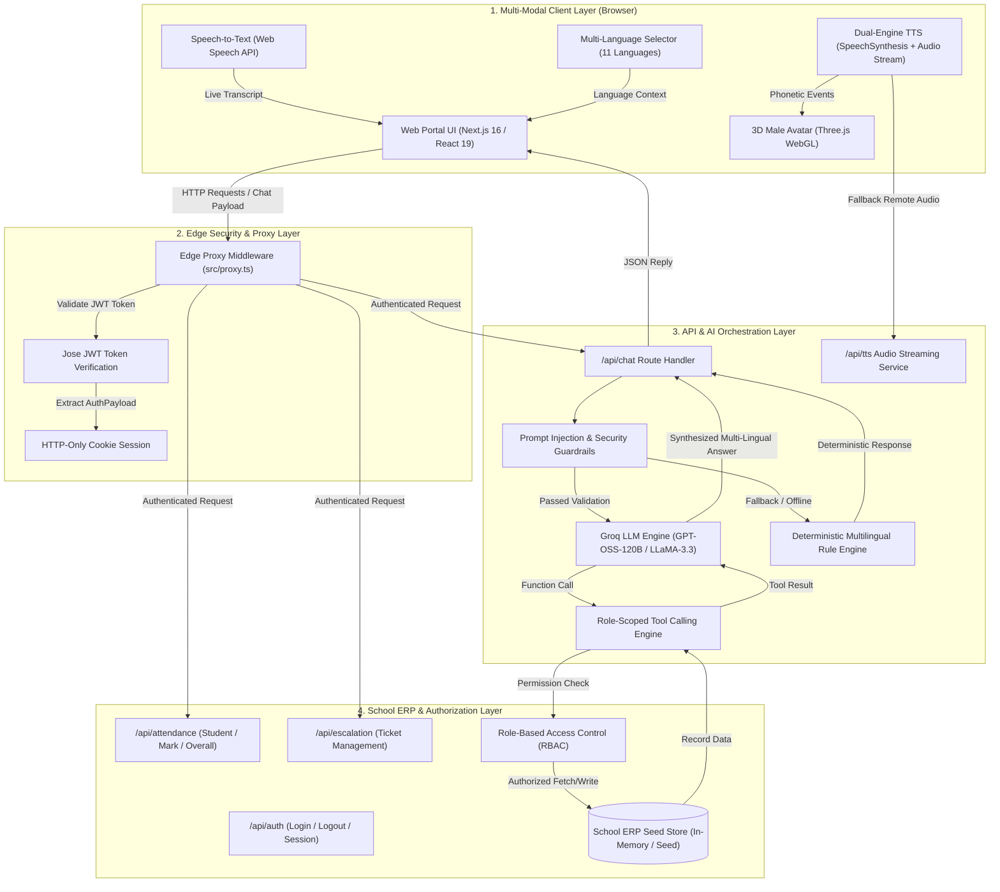
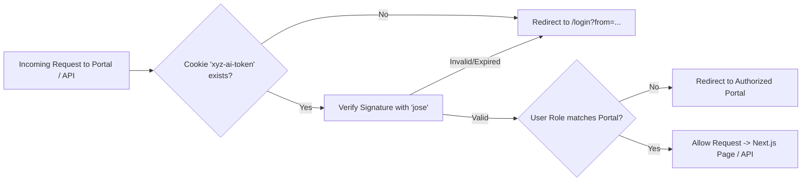
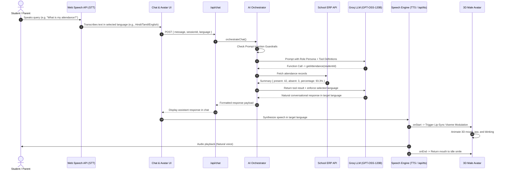
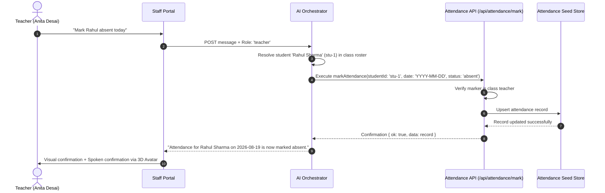
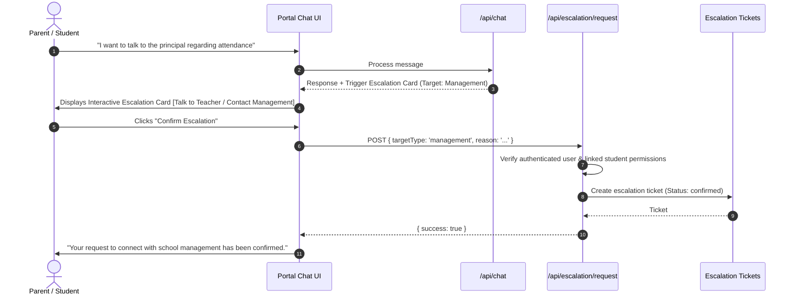

# XYZ AI · Human-Like School Assistant

> This project was built for the **Bharat Academix AI and ML Competition**.

XYZ AI is a standalone Applied AI solution built for school ecosystems. It interacts with **Students**, **Parents**, **Teachers**, and **School Leadership / Principals** through **Chat**, **Voice (Speech-to-Text & Text-to-Speech)**, and an **Interactive 3D Male Avatar with Lip-Sync**.

---

## Key Features

### 1. 3D Male Avatar with Dynamic Lip-Sync
- **Interactive 3D Face**: Rendered with Three.js (WebGL) featuring masculine facial geometry, textured hair, collar, and purple tie.
- **Phonetic Lip-Sync**: Multi-frequency viseme mouth modulation synchronizes jaw and lip movement to speech audio in real time.
- **Natural Micro-Animations**: Realistic periodic eye blinking (every 2.5–4.5s), idle breathing motion, and attentive head-tilting in listening mode.

### 2. Multi-Language Voice System (STT & TTS)
- **Universal Dual-Engine Speech**:
  - **Speech-to-Text (STT)**: Microphone speech recognition via the Web Speech API with BCP-47 locale matching.
  - **Text-to-Speech (TTS)**: Hybrid synthesis using native browser voices and a server-side audio streaming endpoint (`/api/tts`) to guarantee 100% fluent speech across all platforms.
- **11 Supported Indian Languages**: English, Hindi, Tamil, Telugu, Marathi, Bengali, Gujarati, Punjabi, Kannada, Malayalam, and Urdu.

### 3. Role-Based Personas & Security
- **Role Scoping & Isolation**: Strict JWT authentication with HTTP-only cookies and edge proxy validation (`src/proxy.ts`).
- **Mock API Enforcement**: Application-layer authorization matrix prevents cross-role data leaks or unauthorized actions.
- **Anti-Role Spoofing & Prompt Injection Defense**: Heuristic and prompt-level defenses block role-override and prompt-leak attempts.

### 4. Authority Escalation Flow
- Interactive escalation cards and natural-language triggers allow Students and Parents to request callbacks from classroom teachers or school management.
- Backend records and confirms escalation tickets via `/api/escalation/request`.

---

## System Architecture & Technical Design

### 1. High-Level Architecture Diagram



---

### 2. Subsystem Architecture

#### A. Multi-Modal Interface Layer
1. **Interactive 3D Male Avatar (`src/components/ThreeAvatar.tsx`)**:
   - Built on **Three.js** with real-time WebGL rendering.
   - Masculine facial topology with sculpted jawline, quiff hairstyle, suit collar, and purple tie.
   - **Phonetic Lip-Sync**: Multi-frequency wave modulation computes syllable energy (`wave1`, `wave2`, `wave3`) to articulate jaw drop and viseme expansion during speech output.
   - **Micro-Animations**: Periodic eyelid blinking (every 2.5–4.5s), subtle breathing bobbing, and attentive head-tilt in voice listening mode.

2. **Universal Multi-Language Voice Pipeline (`src/lib/use-voice.ts`)**:
   - **Speech-to-Text (STT)**: Uses browser `SpeechRecognition` configured with the selected BCP-47 language tag (`hi-IN`, `ta-IN`, `te-IN`, `mr-IN`, `bn-IN`, `gu-IN`, `pa-IN`, `kn-IN`, `ml-IN`, `ur-IN`, `en-IN`).
   - **Dual-Engine Text-to-Speech (TTS)**:
     - *Primary*: Evaluates local `window.speechSynthesis` voices matching the target language and male voice preferences.
     - *Universal Stream Fallback*: If the client operating system lacks regional Indian voices (common on Windows/macOS), streams native pronunciation audio from the `/api/tts` audio endpoint.

---

#### B. Security & Edge Proxy Layer (`src/proxy.ts`)
1. **Route Protection**: Intercepts all portal routes (`/student-portal`, `/parent-portal`, `/staff-portal`, `/management-portal`) and protected API routes at the edge.
2. **Cryptographic Validation**: Verifies JWT signatures via `jose` using `HS256` encryption and secret tokens stored in `httpOnly` secure cookies.
3. **Role Enforcement**: Checks user role in the payload against destination portal path (`PORTAL_ROLES`). Redirects unauthorized attempts to the user's authorized portal or `/login`.



---

#### C. AI Orchestration & Tool Calling Layer (`src/lib/ai-orchestrator.ts`)
1. **Security Guardrails (`detectPromptInjection`)**: Analyzes incoming messages against regex and semantic patterns for prompt extraction, role overrides (`"act as principal"`, `"ignore instructions"`), and API key harvesting.
2. **Groq Tool-Calling Engine**: Maps role-specific tools:
   - `student`: `getAttendance` (self only), `requestEscalation`.
   - `parent`: `getAttendance` (linked child only), `requestEscalation`.
   - `teacher`: `getAttendance` (class roster), `markAttendance`.
   - `principal`: `getOverallAttendance`, `getAttendance` (all students).
   - Feeds tool definitions to Groq (`openai/gpt-oss-120b` / `llama-3.3-70b-versatile`).
3. **Multi-Language Generation**: Enforces target language script and vocabulary across all **11 Indian languages**.
4. **Deterministic Rule Fallback**: If the LLM provider is offline or rate-limited, a localized rule engine processes intents and returns grammatically natural human-like responses in the user's chosen language.

---

#### D. School ERP Data & Mock API Layer
- **Seed Data Store (`src/lib/data/seed.ts`)**:
  - `users`: User profiles with roles, credentials, linked student IDs, and class assignments.
  - `students`: Student master records, grades, and roll numbers.
  - `attendanceRecords`: Attendance history with timestamps, dates, statuses (`present`, `absent`, `late`), and marker IDs.
  - `escalationRequests`: Logged escalation tickets for teacher/management callbacks.
- **RESTful Endpoints**:
  - `GET /api/attendance/[studentId]` — Fetch individual attendance records with role authorization.
  - `POST /api/attendance/mark` — Record/update student attendance (teacher-only).
  - `GET /api/attendance/overall` — Institutional analytics and grade breakdown (principal-only).
  - `POST /api/escalation/request` — Create support ticket with authorities.
  - `GET /api/tts` — Multi-language audio streaming bridge.

---

### 3. Interaction Sequences

#### Sequence 1: Multi-Language Voice Attendance Query (Student / Parent)



---

#### Sequence 2: Teacher Marking Attendance via Chat / Voice



---

#### Sequence 3: Authority Escalation Flow



---

### 4. Role Authorization Matrix

| Action / Endpoint | Student (`rahul@school.xyz`) | Parent (`priya@parent.xyz`) | Teacher (`anita@school.xyz`) | Principal (`vikram@school.xyz`) |
|---|---|---|---|---|
| **View Own Attendance** | ✅ Self only (`stu-1`) | ❌ N/A | ❌ N/A | ❌ N/A |
| **View Child's Attendance** | ❌ Access Denied | ✅ Linked Child (`stu-1`) | ❌ N/A | ❌ N/A |
| **View Class Attendance** | ❌ Access Denied | ❌ Access Denied | ✅ Assigned Class (`Grade 10-A`) | ❌ N/A |
| **Mark Daily Attendance** | ❌ Access Denied | ❌ Access Denied | ✅ Assigned Class Students | ❌ Access Denied |
| **School-Wide Analytics** | ❌ Access Denied | ❌ Access Denied | ❌ Access Denied | ✅ All Grades & Metrics |
| **Request Callback / Escalation** | ✅ Self Profile | ✅ Linked Child | ❌ N/A | ❌ N/A |
| **Cross-Student Access Attempt** | 🚫 Blocked (403/Denied) | 🚫 Blocked (403/Denied) | 🚫 Blocked (403/Denied) | 🚫 Blocked (403/Denied) |

---

## User Roles & Capabilities

| Role | Persona | Permissions & Capabilities | Example Query |
|---|---|---|---|
| **Student** | Academic Mentor | View own attendance and profile data | *"What is my attendance?"* |
| **Parent** | Family Counselor | View linked child's attendance, request teacher callbacks | *"How much attendance does my child have?"* |
| **Teacher** | Classroom Assistant | View class rosters, mark daily student attendance | *"Mark Rahul absent today."* |
| **Principal** | Executive Assistant | School-wide attendance analytics, grade-level metrics | *"What is the overall attendance?"* |

---

## Demo Credentials

You can use the **Quick Demo Login** buttons on `/login` or enter the credentials below:

| Role | Name | Email | Password | Linked Student / Class |
|---|---|---|---|---|
| **Student** | Rahul Sharma | `rahul@school.xyz` | `student123` | `stu-1` (Grade 10-A) |
| **Parent** | Priya Sharma | `priya@parent.xyz` | `parent123` | Linked to Rahul Sharma (`stu-1`) |
| **Teacher** | Anita Desai | `anita@school.xyz` | `teacher123` | Class Teacher (Grade 10-A) |
| **Principal** | Dr. Vikram Mehta | `vikram@school.xyz` | `principal123` | All Grades & Students |

---

## Technology Stack

- **Framework**: Next.js 16 (App Router, Turbopack, Edge Proxy Middleware)
- **3D Graphics**: Three.js (WebGL)
- **Styling**: Tailwind CSS & Vanilla CSS Design Tokens (White primary + `#8b5cf6` secondary accent, zero gradients)
- **Icons**: `react-icons` (Feather Icons)
- **Authentication**: `jose` (JWT signing and edge verification)
- **LLM Orchestration**: Groq SDK (`openai/gpt-oss-120b` / `llama-3.3-70b-versatile`) with deterministic multi-language rule fallback

---

## Setup & Running Locally

### 1. Prerequisites
- Node.js 18.18+ or 20+
- npm (or yarn / pnpm)

### 2. Clone and Install Dependencies
```bash
git clone https://github.com/BhumikaYeole/xyz-ai.git
cd xyz-ai
npm install
```

### 3. Configure Environment Variables
Create a `.env` file in the root directory:
```env
JWT_SECRET=xyz-ai-secret-key-production
GROQ_API_KEY=your_groq_api_key_here
GROQ_MODEL=openai/gpt-oss-120b
```
*(Note: If `GROQ_API_KEY` is omitted, the built-in deterministic multi-language rule orchestrator handles all queries).*

### 4. Run Development Server
```bash
npm run dev
```
Open [http://localhost:3000](http://localhost:3000) in your browser.

### 5. Production Build
```bash
npm run build
npm run start
```
